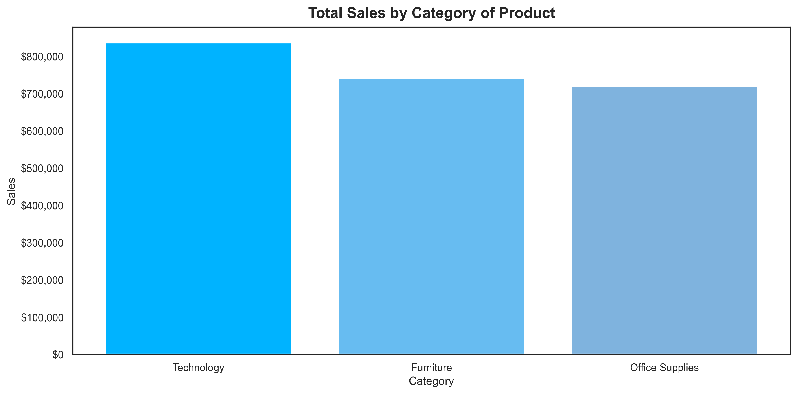
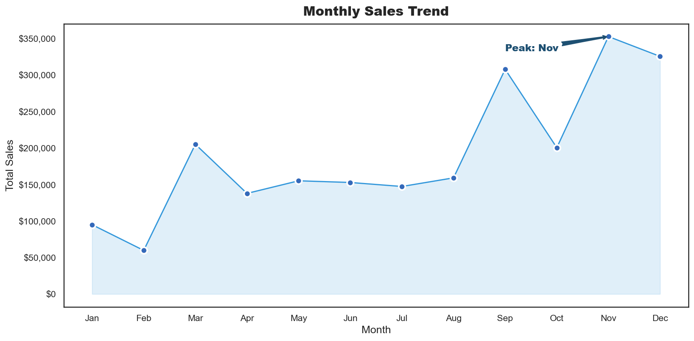

# 🛒 Retail Sales Analysis Dashboard

## 📌 Project Overview
An end-to-end data analysis project analyzing retail sales data 
from a US superstore. The project involves data cleaning, 
exploratory data analysis (EDA) in Python, and an interactive 
dashboard built in Power BI.

---

## 🎯 Business Problem
A retail company needs to understand:
- Which product categories generate the most revenue?
- Which regions are underperforming?
- Which sub-categories are losing money?
- What are the seasonal sales trends?

---

## 💡 Key Insights Found
- **Technology** is the highest revenue category ($0.84M)
- **Tables and Bookcases** are loss-making sub-categories
- **California** is the highest revenue state
- **November** is the peak sales month
- **Furniture** has only 2.49% profit margin despite high sales

---

## 🛠️ Tools & Technologies
| Tool | Purpose |
|------|---------|
| Python | Data cleaning and EDA |
| Pandas | Data manipulation |
| Matplotlib | Data visualization |
| Seaborn | Statistical charts |
| Power BI | Interactive dashboard |
| Jupyter Notebook | Development environment |
| Git & GitHub | Version control |

---

## 📁 Project Structure

retail-sales-dashboard/
├── data/
│   ├── raw/          ← Original dataset (download from Kaggle)
│   └── processed/    ← Cleaned dataset (generated by notebook)
├── notebooks/
│   └── exploratory.ipynb  ← Main analysis notebook
├── dashboard/
│   └── retail_sales_dashboard.pbix  ← Power BI dashboard
├── outputs/
│   ├── 01_sales_by_category.png
│   ├── 02_sales_vs_profit_category.png
│   ├── 03_sales_by_region.png
│   ├── 04_monthly_sales_trend.png
│   ├── 05_profit_by_subcategory.png
│   └── 06_sales_by_segment.png
├── requirements.txt
└── README.md

---

## 📊 Dashboard Preview



---

## 🚀 How to Run This Project

### 1. Clone the repository
```bash
git clone https://github.com/YourUsername/retail-sales-dashboard.git
```

### 2. Install dependencies
```bash
pip install -r requirements.txt
```

### 3. Download the dataset
Download from Kaggle:
https://www.kaggle.com/datasets/vivek468/superstore-dataset-final

Save as: `data/raw/superstore.csv`

### 4. Run the notebook
Open `notebooks/exploratory.ipynb` in VS Code or Jupyter

### 5. View the dashboard
Open `dashboard/retail_sales_dashboard.pbix` in Power BI Desktop

---

## 📈 Python Charts Generated
1. Sales by Category
2. Sales vs Profit by Category
3. Sales by Region
4. Monthly Sales Trend
5. Profit by Sub-Category (Red/Green)
6. Sales by Customer Segment

---

## 👤 Author
**Thota Venkata Vishnu Vardhan**
- GitHub: https://github.com/Venkatavishnuvardhanthota
- LinkedIn: https://www.linkedin.com/in/venkata-vishnu-vardhan-thota/
