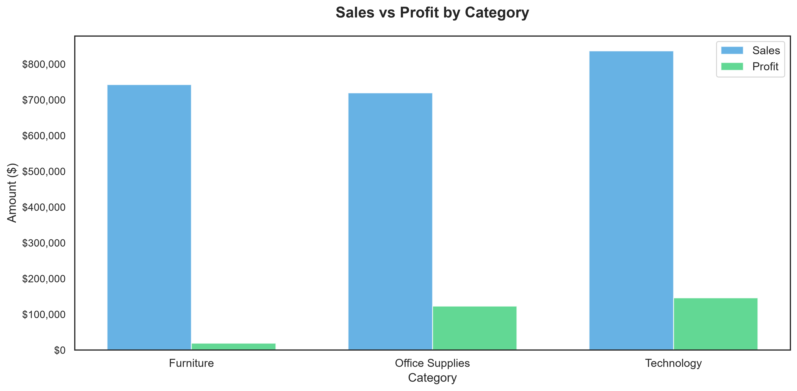
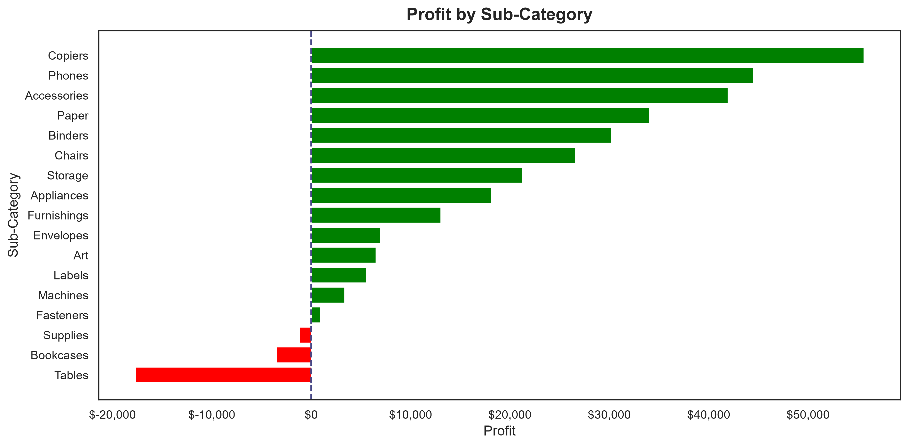
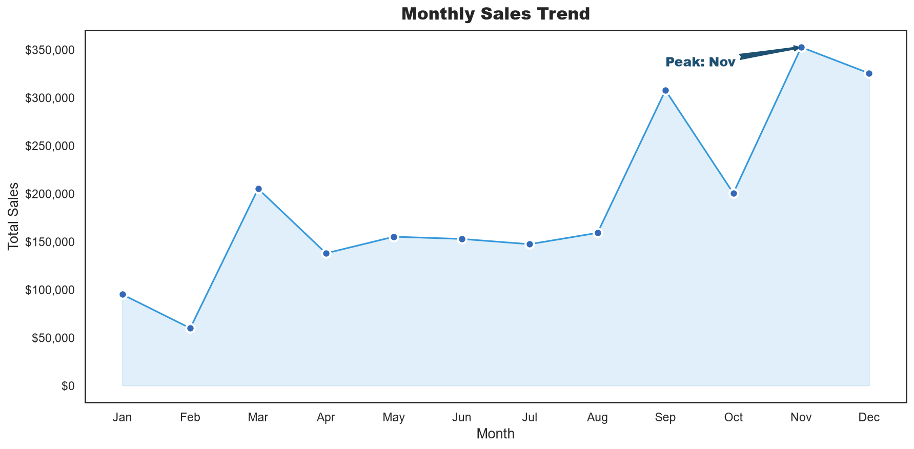

# Retail Sales Analysis Dashboard

Python exploratory analysis and an interactive Power BI dashboard on 9,994 orders from a US superstore: where the revenue comes from, which products lose money, which regions lag, and when sales peak.

**Tools:** Python (Pandas, Matplotlib, Seaborn) · Power BI · Jupyter Notebook

---

## Business questions and what the data says

| Question | Answer |
|----------|--------|
| Which product categories generate the most revenue? | Technology, at $836K. Furniture is second ($742K) and Office Supplies third ($719K). |
| Which regions are underperforming? | South has the lowest sales ($392K). Central has the weakest profit margin (7.9%, against 14.9% in West). |
| Which sub-categories are losing money? | Tables, Bookcases and Supplies. |
| What does the seasonal trend look like? | November is the peak month, with September and December also high. |

## Key findings

- The store made **$2.30M in sales and $286K in profit** across 9,994 orders, a 12.5% overall margin.
- **Furniture sells a lot but earns almost nothing.** It brings in $742K of sales at a 2.49% margin, against 17.4% for Technology and 17.0% for Office Supplies.
- **Technology is the top category** by revenue ($0.84M) and also earns a healthy margin.
- **Three sub-categories lose money:** Tables, Bookcases and Supplies. Tables is the biggest loss.
- **California** is the highest-revenue state.
- **Regional picture:**

| Region | Sales | Profit margin |
|--------|-------|---------------|
| West | $725K | 14.9% |
| East | $679K | 13.5% |
| Central | $501K | 7.9% |
| South | $392K | 11.9% |

The data shows where money is made and lost, not why. Discounts are in the dataset but are not analysed here; testing how discount level relates to margin in Tables and Bookcases is the obvious next step.

---

## Charts

**Sales vs profit by category.** Furniture's profit is tiny next to its sales.



**Profit by sub-category.** Red bars lose money.



**Monthly sales trend.**



All six charts are in the [`outputs/`](outputs/) folder.

## Power BI dashboard

The interactive dashboard is in [`dashboard/retail_sales_dashboard.pbix`](dashboard/retail_sales_dashboard.pbix). It has KPI cards, a US state sales map, a region slicer and drill-down filters, so you can go from the headline numbers down to a state or sub-category. Open it in Power BI Desktop.

<!-- After exporting a screenshot from Power BI Desktop, save it as dashboard/dashboard_overview.png and uncomment the next line:

-->

---

## Data

- **Source:** [Superstore dataset (Kaggle)](https://www.kaggle.com/datasets/vivek468/superstore-dataset-final), file `Sample - Superstore.csv`
- **Size:** 9,994 rows, 21 columns
- **Quality checks:** no missing values and no duplicate rows
- **Cleaning in the notebook:** converted order and ship dates to proper dates, added order year, order month, month name and shipping duration, then saved the cleaned data (26 columns)

The data files are not stored in this repository (see `.gitignore`). Download the original from Kaggle to run the notebook.

## Tech stack

| Tool | Used for |
|------|----------|
| Python | Data cleaning and exploratory analysis |
| Pandas | Data manipulation |
| Matplotlib, Seaborn | Charts |
| Power BI | Interactive dashboard |
| Jupyter Notebook | Analysis notebook |
| Git and GitHub | Version control |

## Repository structure

```
retail-sales-dashboard/
├── README.md
├── requirements.txt
├── .gitignore
├── notebooks/
│   └── exploratory.ipynb                    # cleaning, analysis and chart generation
├── dashboard/
│   └── retail_sales_dashboard.pbix          # Power BI dashboard
└── outputs/
    ├── 01_sales_by_category.png
    ├── 02_sales_vs_profit_category.png
    ├── 03_sales_by_region.png
    ├── 04_monthly_sales_trend.png
    ├── 05_Profit_by_Sub-Category.png
    └── 06_sales_by_segment.png

data/                                        # not in the repo; you create it (see below)
├── raw/                                     # original Kaggle file goes here
└── processed/                               # cleaned file is written here by the notebook
```

## How to run

1. **Clone the repository**
   ```bash
   git clone https://github.com/Venkatavishnuvardhanthota/retail-sales-dashboard.git
   cd retail-sales-dashboard
   ```
2. **Install the dependencies**
   ```bash
   pip install -r requirements.txt
   ```
3. **Download the dataset** from the Kaggle link above. Create two folders, `data/raw` and `data/processed`, and save the file as `data/raw/Sample - Superstore.csv`. The notebook reads that exact name and the file's windows-1252 encoding.
4. **Run the notebook.** Open `notebooks/exploratory.ipynb` in VS Code or Jupyter and run all cells. It regenerates the charts in `outputs/`.
5. **View the dashboard.** Open `dashboard/retail_sales_dashboard.pbix` in Power BI Desktop.

## Author

**Venkata Vishnu Vardhan Thota**
- Email: [venkatavishnuvardhanthota@gmail.com](mailto:venkatavishnuvardhanthota@gmail.com)
- GitHub: [Venkatavishnuvardhanthota](https://github.com/Venkatavishnuvardhanthota)
- LinkedIn: [venkata-vishnu-vardhan-thota](https://www.linkedin.com/in/venkata-vishnu-vardhan-thota/)